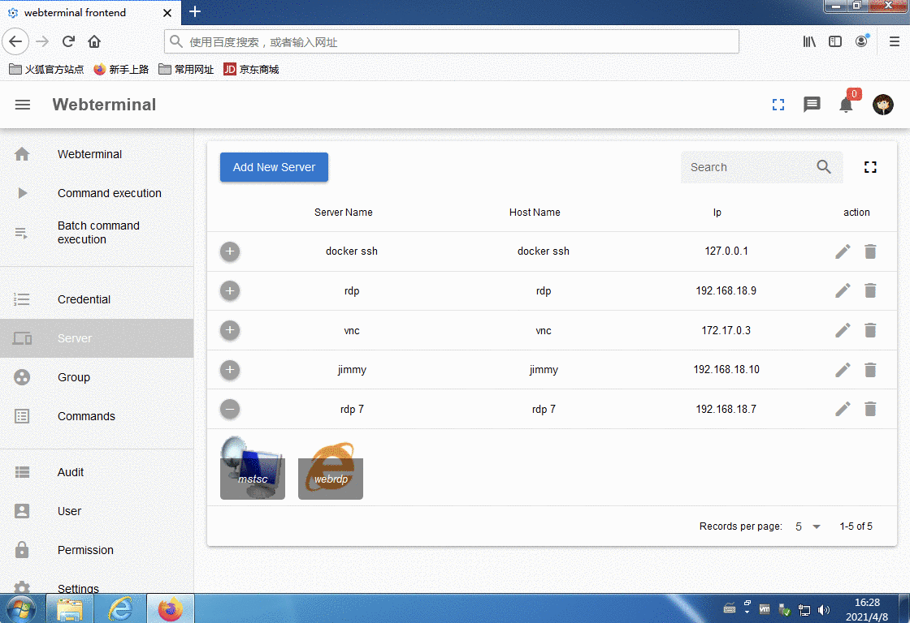
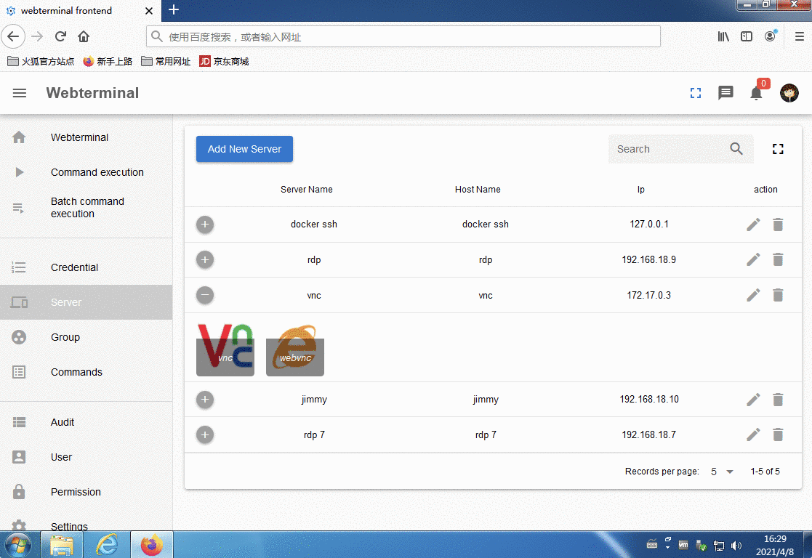
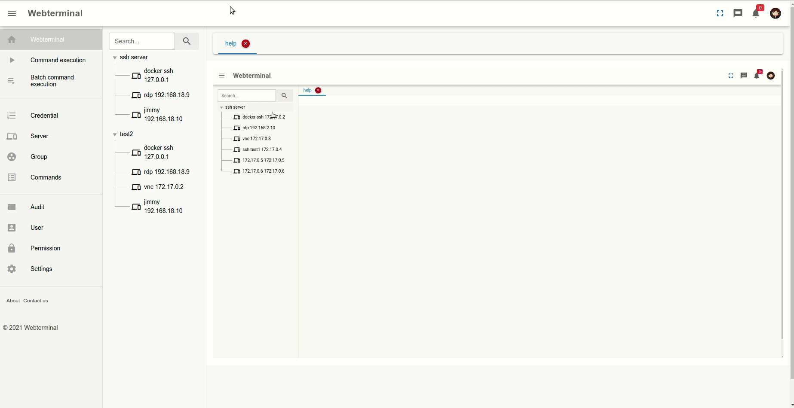
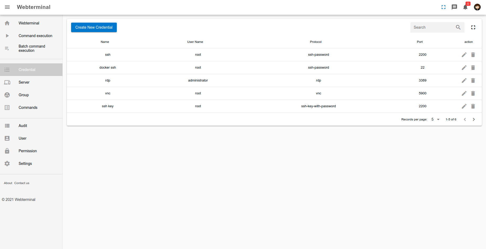
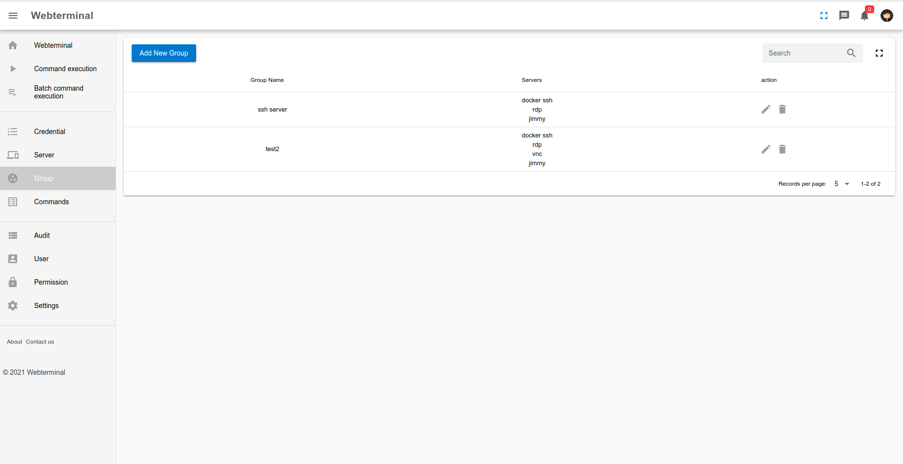
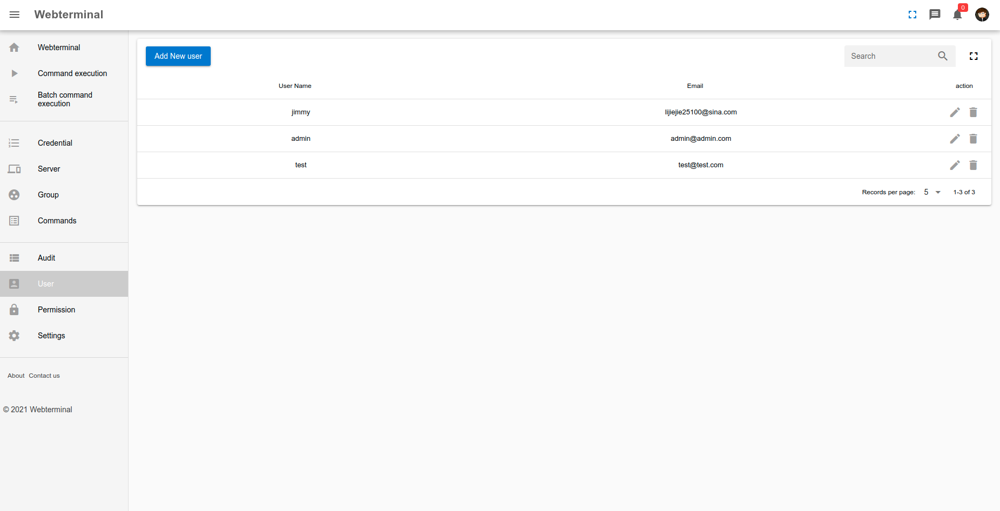
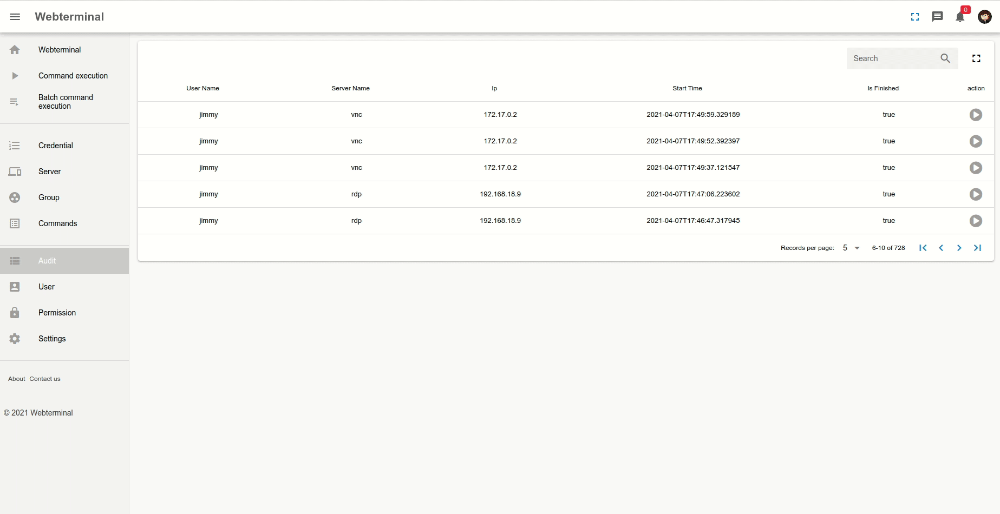
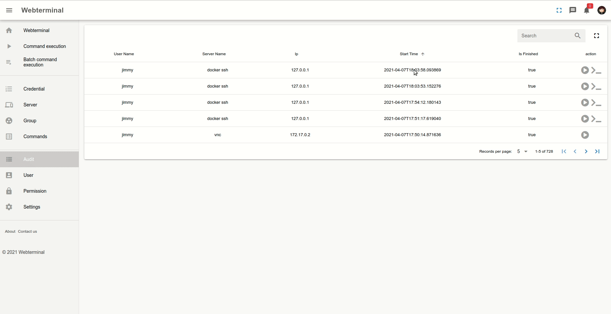

# Webterminal bastion server (webterminal堡垒机)
[](https://jimmy201602.github.io/doc/)
[](https://jimmy201602.github.io/doc/zh/)

Webterminal implemented by django.
This project focus on DevOps and Continuous Delivery.
For now it support almost 90% remote management protocol such as vnc, ssh,rdp,telnet,sftp... It support a possiblity to monitor and recorded user action when user use this project to manage their server!You can also replay the user action such as like a video.
Hope you enjoy it.

## Features

- RDP remote desktop control
- VNC remote desktop control
- SSH SFTP protocol support
- Telnet protocol support
- VNC, RDP, SFTP Remote file browser (download, delete, update and upload files)
- Remote command and script execution (shell)
- Realtime user action audit
- User session audit
- Kick user off this project
- SSH command audit
- Permission control
- Webterminal helper support (use your favourite tools to manage and connect server)

## useage manual

# useage

[](https://www.youtube.com/watch?v=-HwhB21v8L8)


## Run with docker compose

```sh
sudo docker-compose up -d
Login user & password
username: admin
password: password!23456
```

## Author Email
zhengge2012@gmail.com

## screenshots


## Ubuntu webterminal helper support


## Mac webterminal helper support

## Windows webterminal helper support

## commercial version provide mstsc helper（rdp clipboard support vs file upload download and vnc protocol connection support）















## License
Open source is not a easy staff, please respect the author's contribution, thank you.

This system has been continuously updated for four years to reach the current project functions. For now, except for the OCR function, other functions have been comparable to the commercial  software! At present, this project has not produced any profit. Based on the author's enthusiasm for power generation with love, it has been found that someone has changed this project for commercial use. I solemnly declare that all consequences arising from the commercialization of this project should be borne by yourself.

Therefore, to avoid disputes, it is not recommended to use commercial products. If you insist on using it, please contact the original author for authorization.

Once again, if you directly use this system in commercial products without contacting the author, this system will not bear any commercial disputes, thank you.

[LGPL-3.0 License](LICENSE)

Copyright (c) 2021 Jimmy

## Reporting Issues
If you're experiencing a problem, we encourage you to open [an issue](https://github.com/jimmy201602/webterminal/issues/new), and share your feedback.
