# webterminal
web terminal implemented by django.
This project focus on DevOps and Continuous Delivery.
For now it support almost 90% remote management protocol such as vnc, ssh,rdp,telnet... It support a possiblity to monitor and recorded user action when user use this project to manage their server!
You can also replay the user action such as like a video.
Hope you enjoy it.

本项目为django框架下实现！为实现自动运维化持续集成及集中化管理IT设备而创建。

现支持绝大多数网络远程管理协议(linux 下ssh、sftp协议、Windows rdp远程管理协议、Telnet远程管理协议及vnc远控协议)。

用户使用此项目时全部操作将会被录像，在必要时可进行回放审计。另可实时监控用户操作，在必要时可强制将用户踢下线！

更多功能请自行发掘......
# useage
[useage](./doc/usage_en.md) 
# Installiation guide
[installiation-en](./doc/install_en.md)  
[中文安装文档](./doc/install_zh.md)  
# Run with docker
```sh
docker pull webterminal/webterminal
docker run -itd -p 80:80 webterminal/webterminal
Login user & password
username: admin
password: password!23456
```
# Author
zhengge2012@gmail.com
# Getting Help
QQ group number 531612760


# screenshots
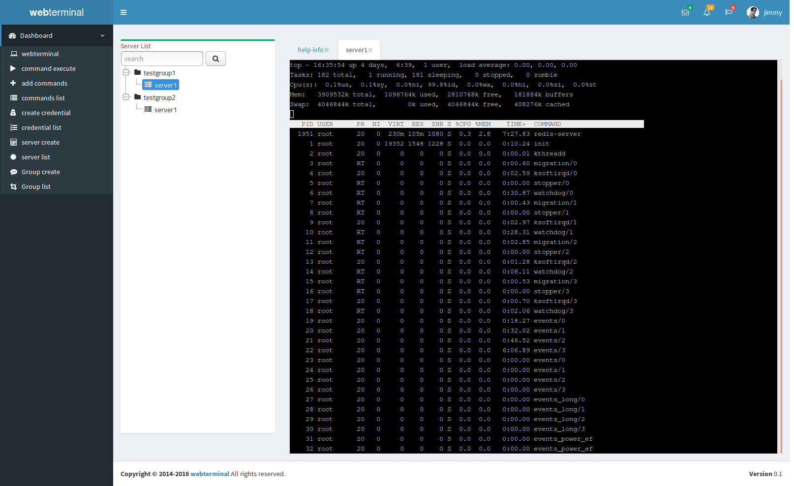
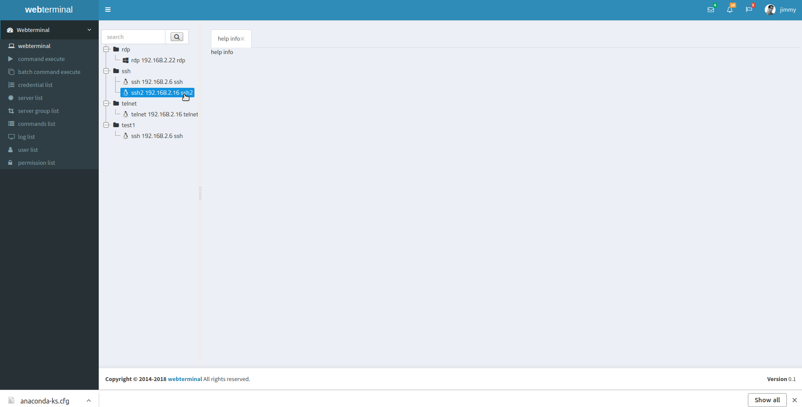
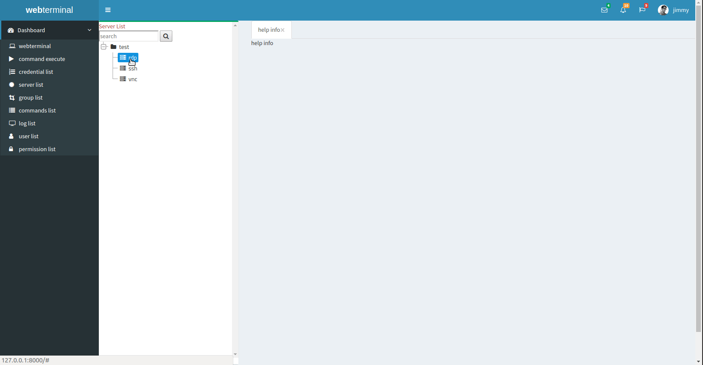
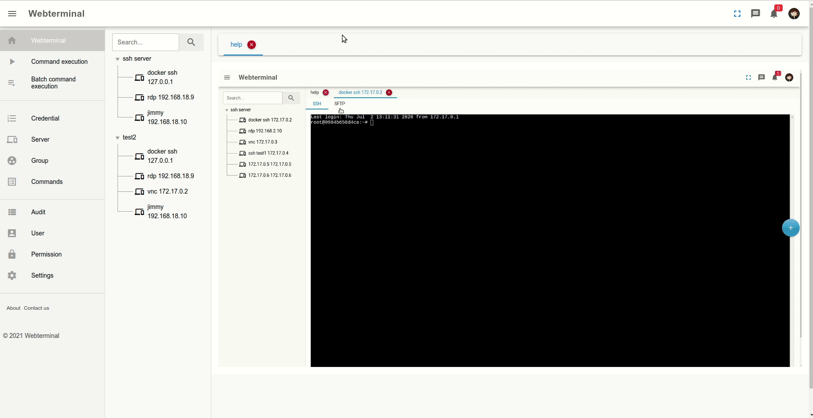
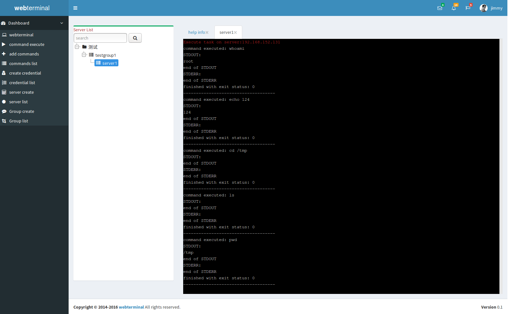

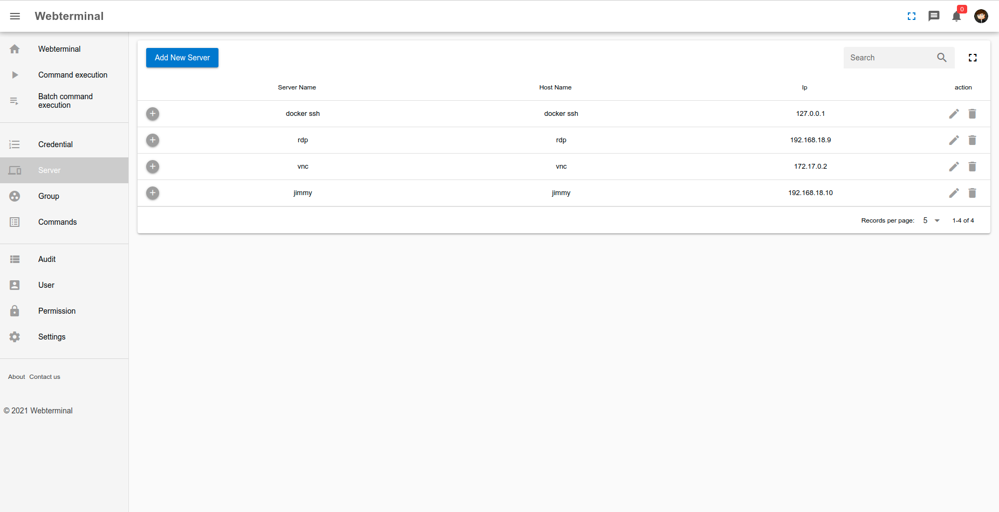
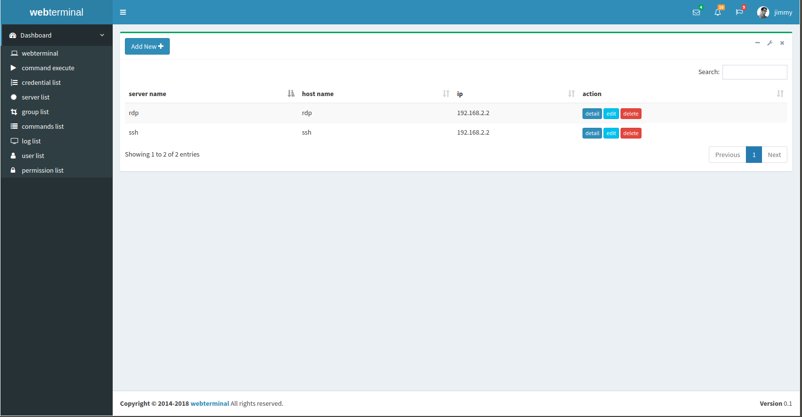
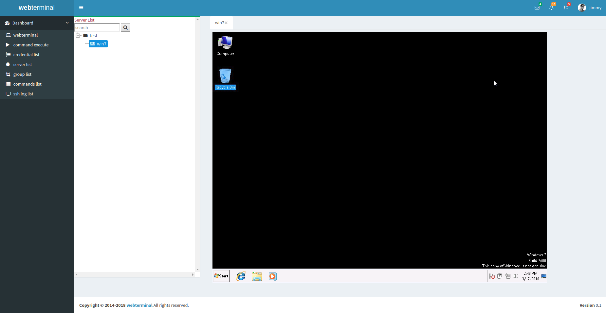
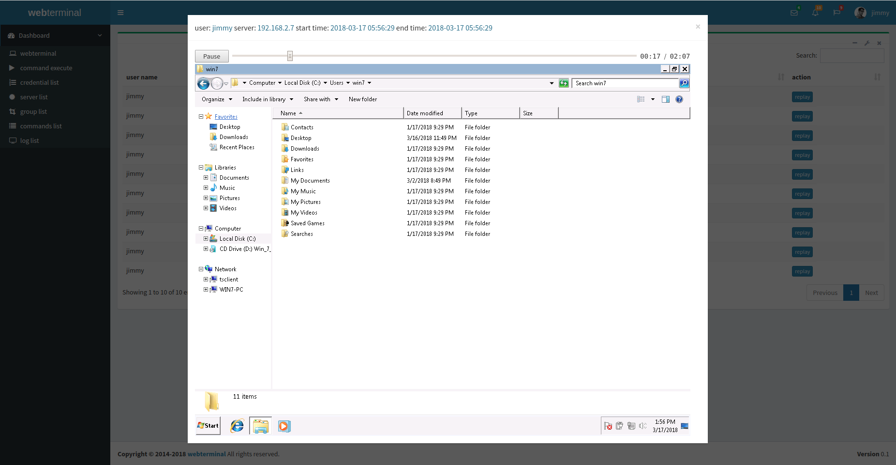
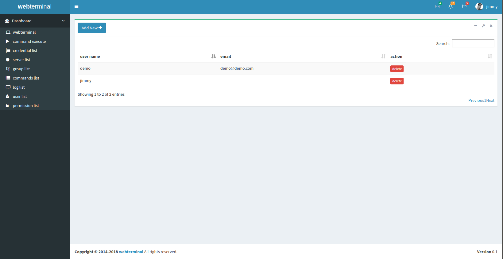
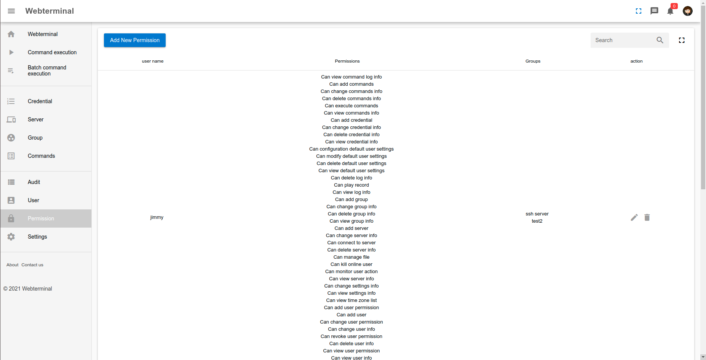
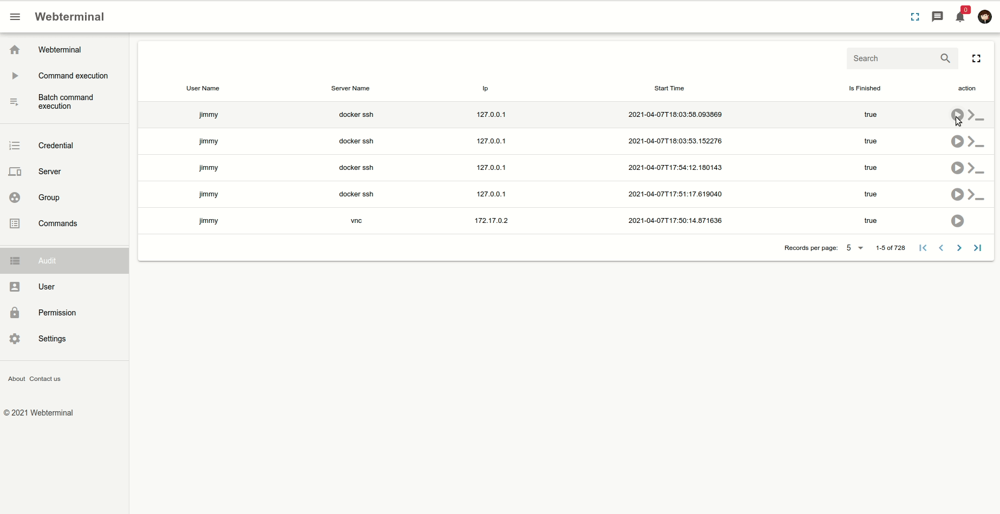
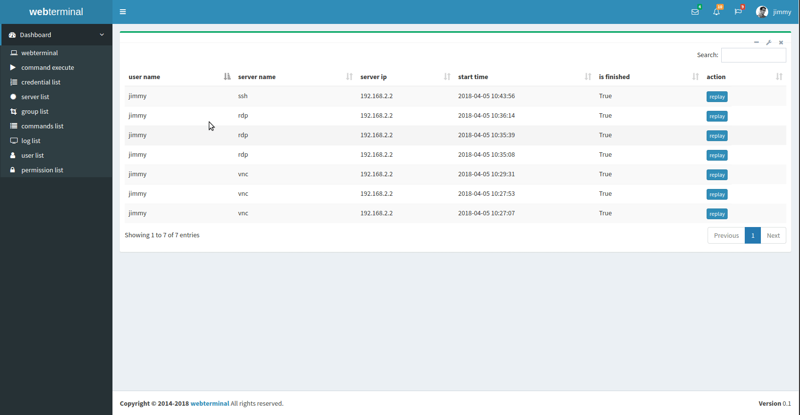
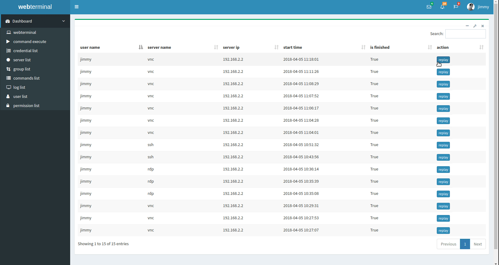

# Many thanks for [遥遥云](http://idc.yygzs.cn/) donate us a demo server

[Online Demo Server](http://ssh.yygzs.cn/) : http://ssh.yygzs.cn/

username: demo

password: demo12345678

# License

[License](LICENSE) 

# Reporting Issues
If you're experiencing a problem, we encourage you to open an issue[an issue](https://github.com/jimmy201602/webterminal/issues/new) , and share your feedback.
# Welcome donate(欢迎打赏)

## wechat(微信)


## alipay(支付宝)
