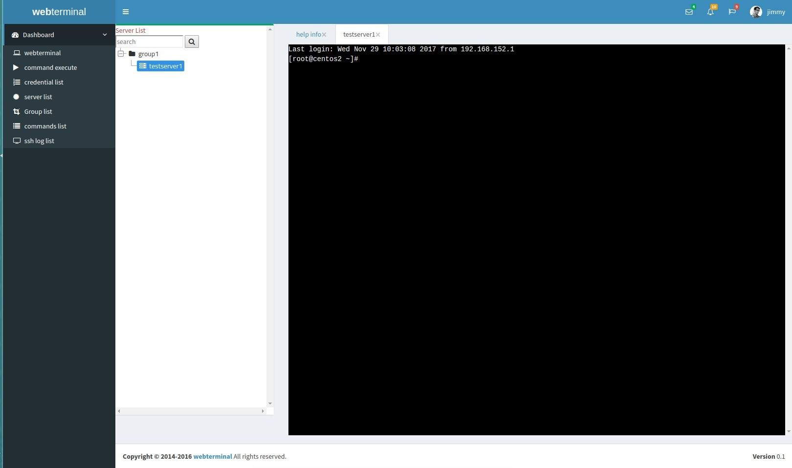
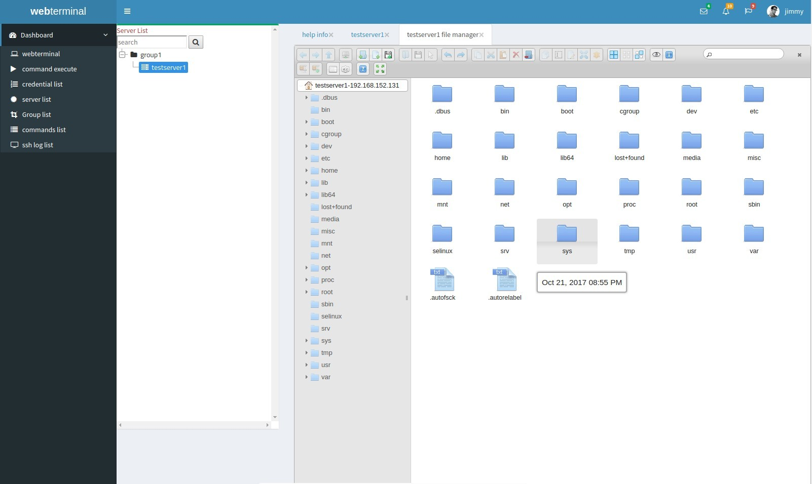
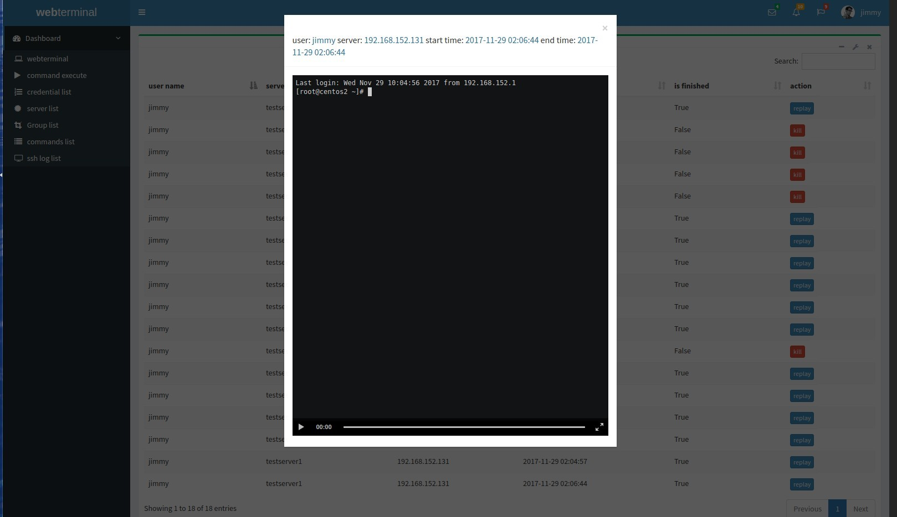
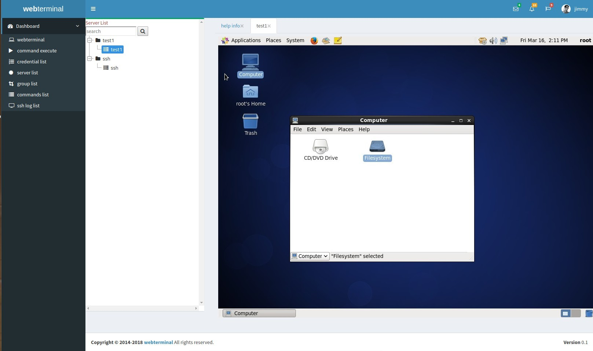

# webterminal
web terminal implemented by django.
This project focus on DevOps and Continuous Delivery.
For now it support all most remote management protocol such as vnc, ssh,rdp,telnet... It support a possiblity to monitor and recorded user action when user use this project to manage their server!
You can also replay the user action such as like a video.
Hope you enjoy it.
# useage
[useage](./doc/usage_en.md) 
# Installiation guide
[installiation-en](./doc/install_en.md)  
[中文安装文档](./doc/install_zh.md)  
# screenshots

# Author
zhengge2012@gmail.com
# QQ group number
531612760
# Many thanks for [遥遥云](http://idc.yygzs.cn/) donate us a demo server

[Online Demo Server](http://ssh.yygzs.cn/) : http://ssh.yygzs.cn/

username: demo

password: demo12345678
