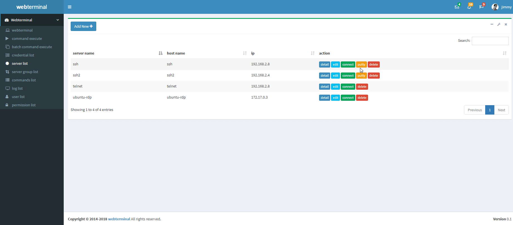
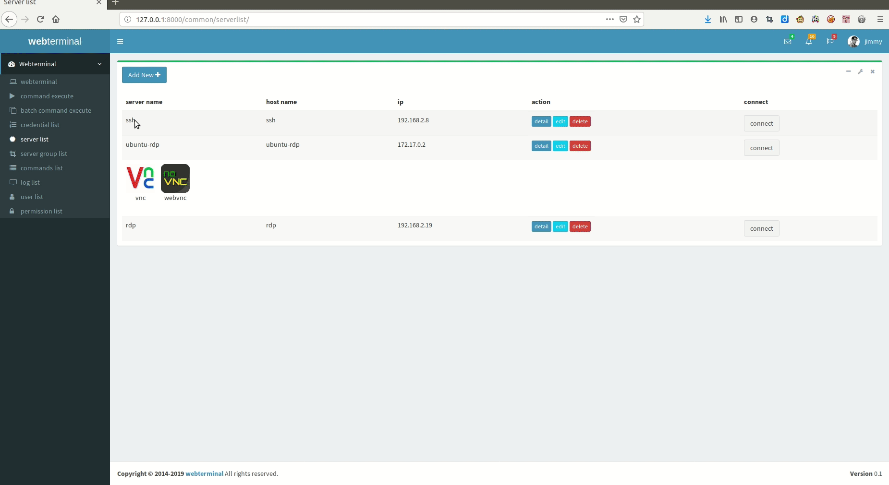
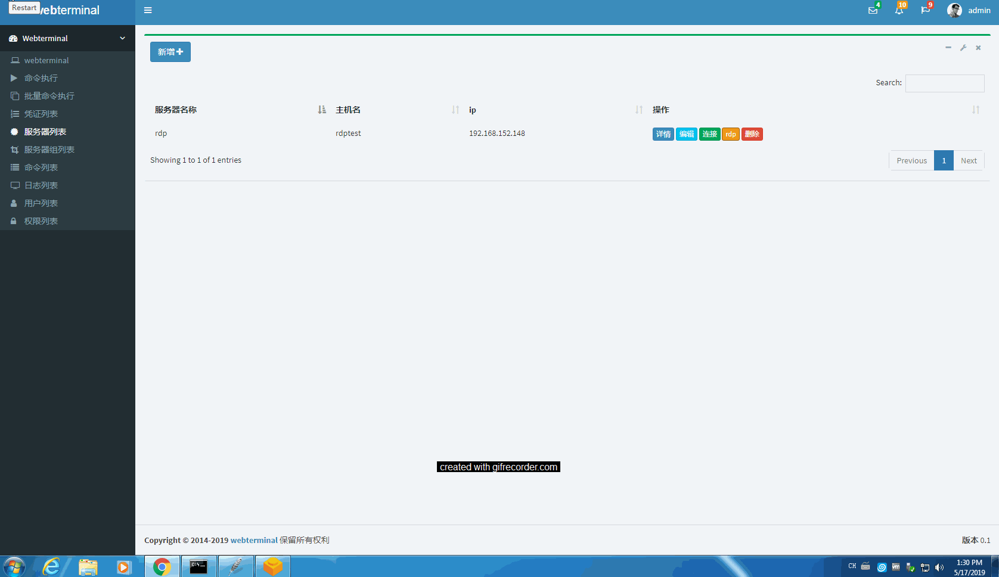

本项目为django框架下实现！为实现自动运维化持续集成及集中化管理IT设备而创建。

现支持绝大多数网络远程管理协议(linux 下ssh、sftp协议、Windows rdp远程管理协议、Telnet远程管理协议及vnc远控协议)。

用户使用此项目时全部操作将会被录像，在必要时可进行回放审计。另可实时监控用户操作，在必要时可强制将用户踢下线！

更多功能请自行发掘......

## 下一版本: *待定,项目将迁移至django 3*

# 使用文档

[中文使用文档](./manual_zh.md)

# 以docker方式运行本项目

[Centos7 Docker安装部署 webterminal](./Centos7_docker_deploy_zh.md)


```sh
docker pull webterminal/webterminal

docker run -itd -p 80:80 -p 2100:2100 webterminal/webterminal

登录账户与密码

账户名: admin

密码: password!23456
```

# demo/试用 

[试用服务器](http://193.112.194.114:8000/)

账户/密码: demo/demo12345678

# QQ讨论群
### QQ群号 531612760


# 欢迎打赏

## 微信


## 支付宝


# 预览


# 开源版本提供ssh调用putty、xshell、securecrt、sftp功能(rdp调用后端不开源)

# Ubuntu 系统webterminal helper 支持


# 苹果系统 webterminal helper 支持

# 商业版本提供rdp本地调用mstsc及vnc功能(支持文本及文件复制粘贴及nla安全认证)



# 开源协议

[开源协议(GPL v3)](../LICENSE) 


# 欢迎提交bug
欢迎提交并反馈[bug](https://github.com/jimmy201602/webterminal/issues/new)
