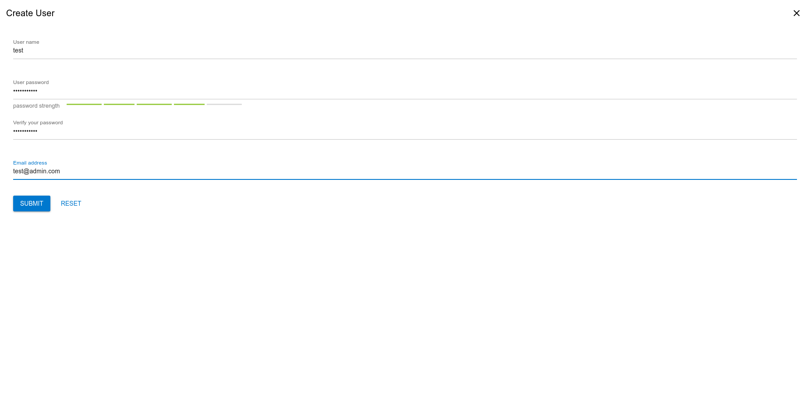
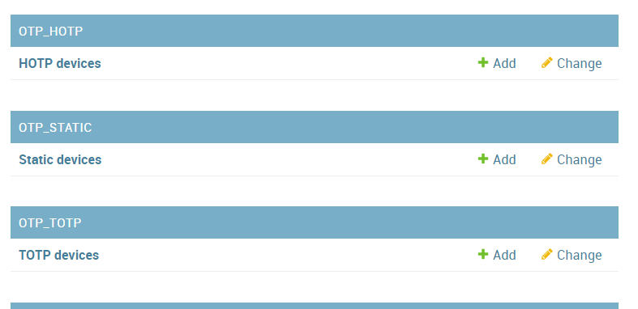
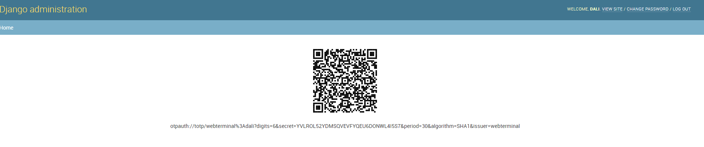

# How to use it

# Create credential

# Create server

# Create group

# Create task

# Creat new login user

# Configure login user permission and server groups

# Webterminal usage

# Task usage

# Use ssh helper to assit you use putty to connect assigned server
Install ssh helper file "webterminal ssh helper.exe" from directory named helper to your windows client.(Note:currently the ssh helper not support custom installation directory, Please do not modify the default directory.)
In the server list page when you click putty then it will connect to ther specified ssh server.
# How to update info
 	On the left panel you can click the credential list ... Then you can update your info when you click the edit button. If you update all your infomation then click submit button.
  
# Add 2F Authentification to users 
  go to /admin and choose TOTP or HTOTP 

# Configure user to TOTP authentification 
 

# Get TOTP Token with Qrcode 
 

