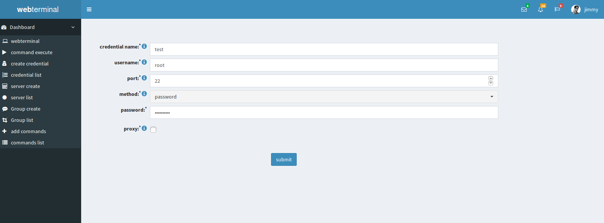
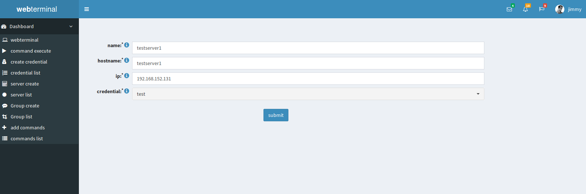
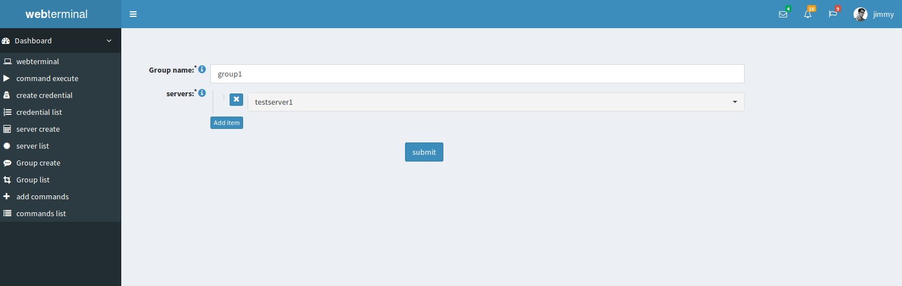
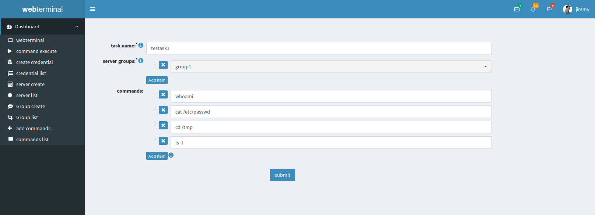
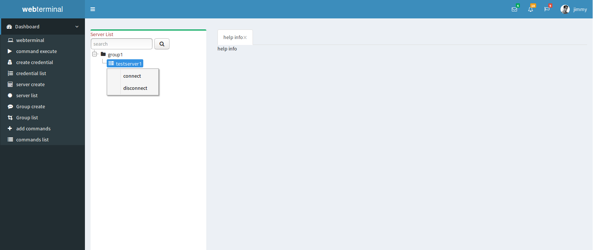
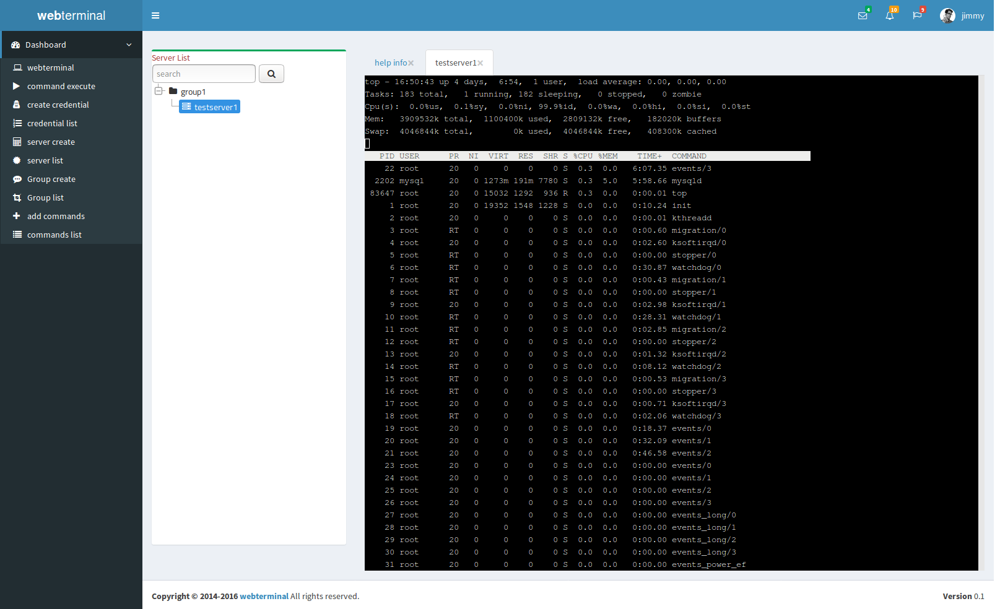
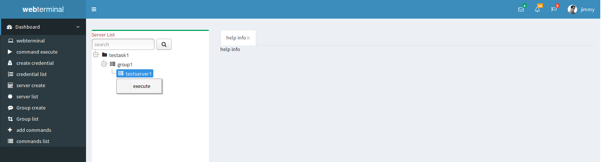
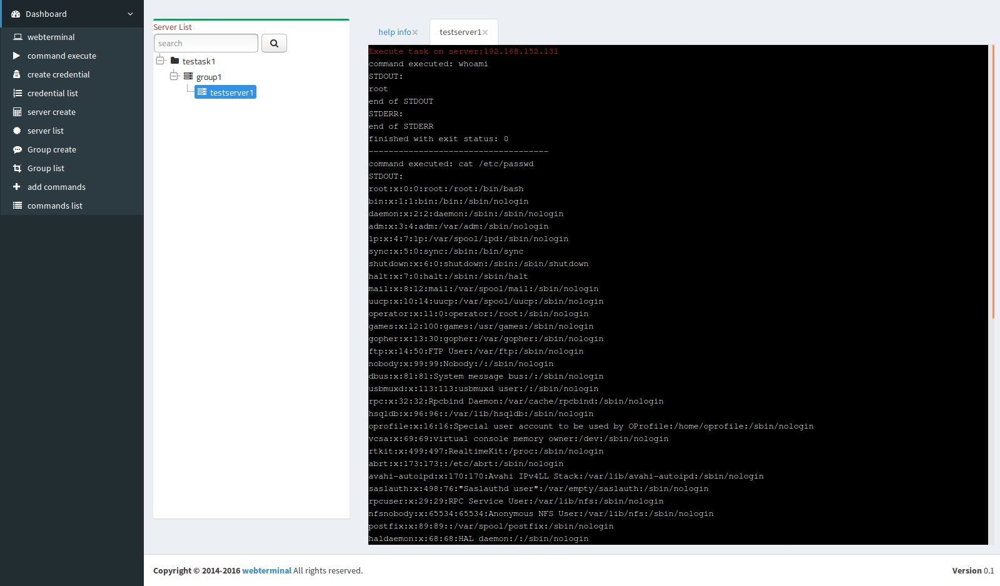
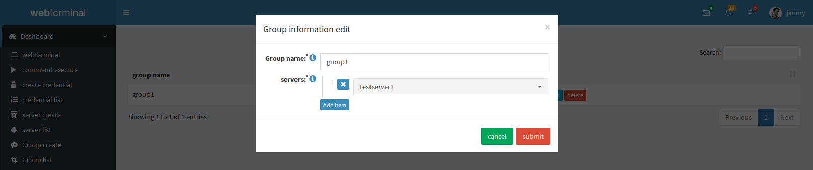

# How to use it

# Create credential

# Create server

# Create group

# Create task

# Webterminal usage

# Task usage

#How to update info
 	On the left panel you can click the credential list ... Then you can update your info when you click the edit button. If you update all your infomation then click submit button.

