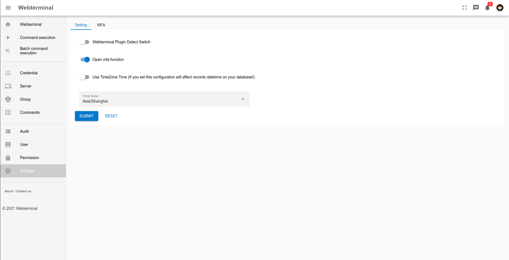

# How to use it

# Create credential

# Create server

# Create group

# Create task

# Creat new login user

# Configure login user permission and server groups

# Webterminal usage

# Task usage

# Use ssh helper to assit you use putty to connect assigned server
Install "Webterminal helper" on your pc client.
In the server list page when you click  then it will connect to ther specified server use your favourite tools.
# How to update info
 	On the left panel you can click the credential list ... Then you can update your info when you click the edit button. If you update all your infomation then click submit button.
  
# Add 2F Authentification to users 
  Use adminitrator account to login to the system. Open the mfa function switch then logout the system and start the project again.

# Configure user mfa authentification if you not configure, on your login page when you login will guideline you to setup.
 

# Follow the instruction to setup mfa authentiification 
 

# Login with mfa authentiification
 