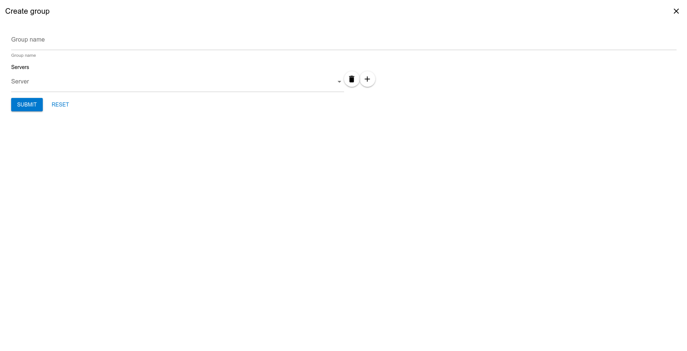
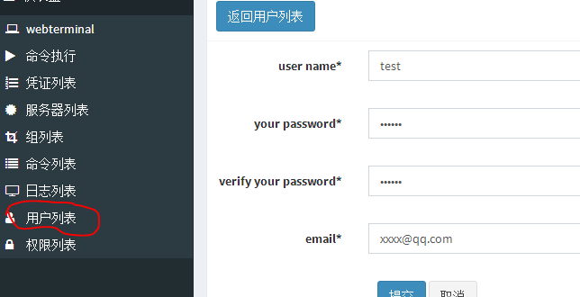
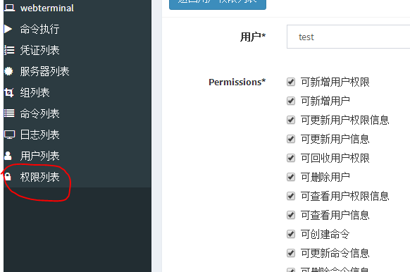
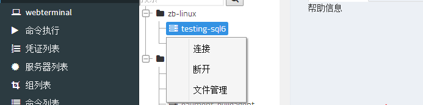
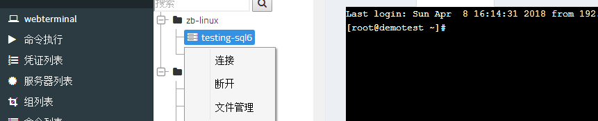
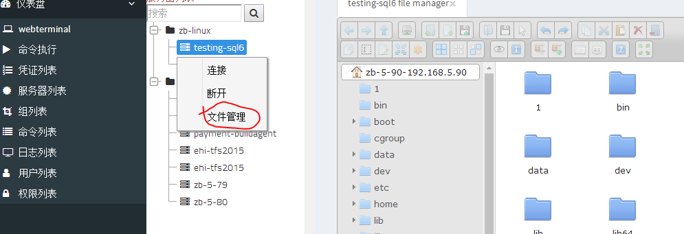
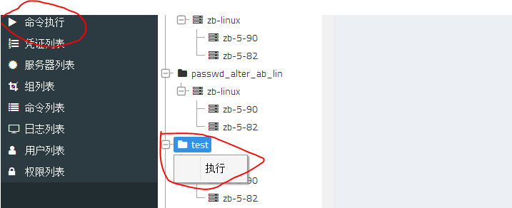
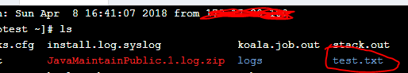

# 操作手册

# 创建资产
## 添加凭证
点击凭证列表，新增；协议支持ssh-key，sh-password，RDP等；凭证列表主要用于管理远程主机时的账号、密码，及使用的远程协议。

## 添加服务器
点击服务器列表，新增；其中，凭证是前面创建的凭证

## 创建服务器组
将服务器添加进组中：点击组列表，新增；Add item将之前创建的服务器添加进组中。

# 创建用户与授权
## 创建用户
用户列表用于管理运维人员登陆账号

## 用户授权
点击权限列表项，下拉可选择用户（用户列表中的用户）；permission为权限，默认拥有所有权限；权限选择完，在最下面服务器组中作用的服务器组（在组列表中那些组)

# 使用webterminal连接远程主机
点击webterminal，选择要远程的主机，点击连接即可
文件管理功能可操作远程主机文件，（目前Windows主机尚不支持文件管理功能）

# 添加命令用于批量操作
点击命令列表，新增test命令
在命令执行下可看到多了一个test命令列表，点击test的执行选项就会对服务器组下的所有主机执行”mkdir test.txt”，返回到webterminal，连接主机，发现根目录下多了一个test.txt文件夹

