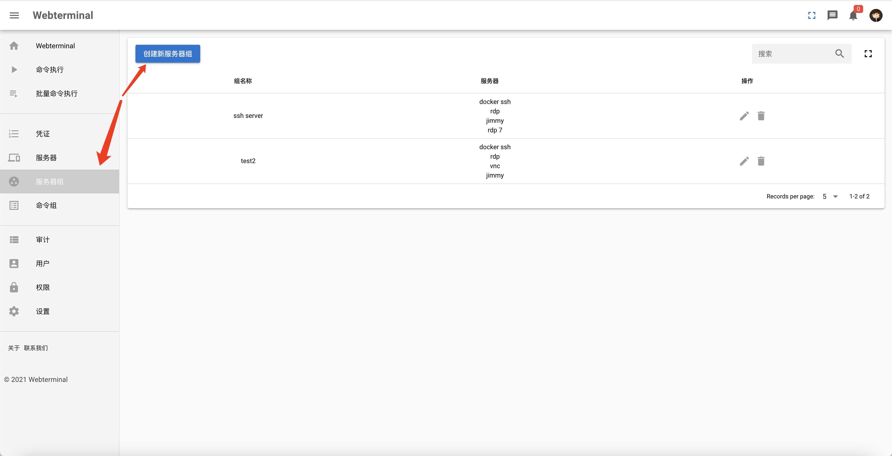
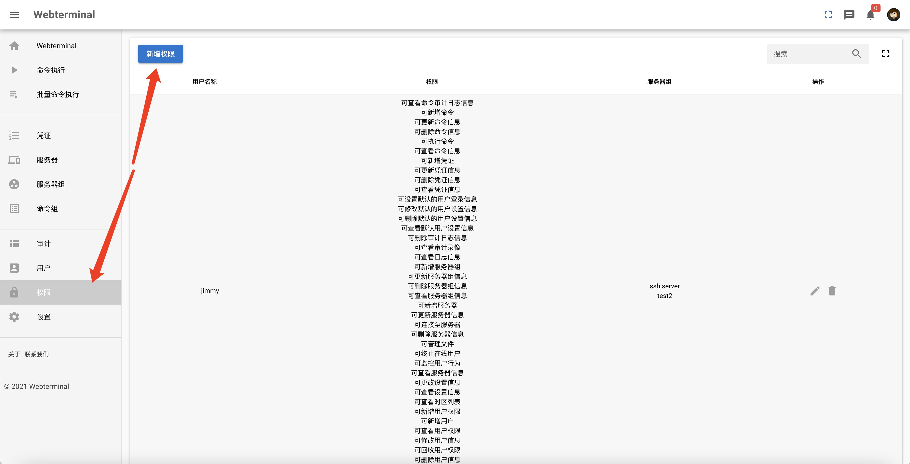
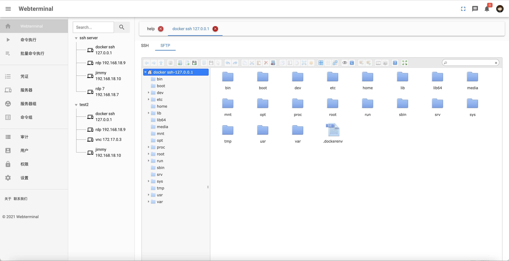
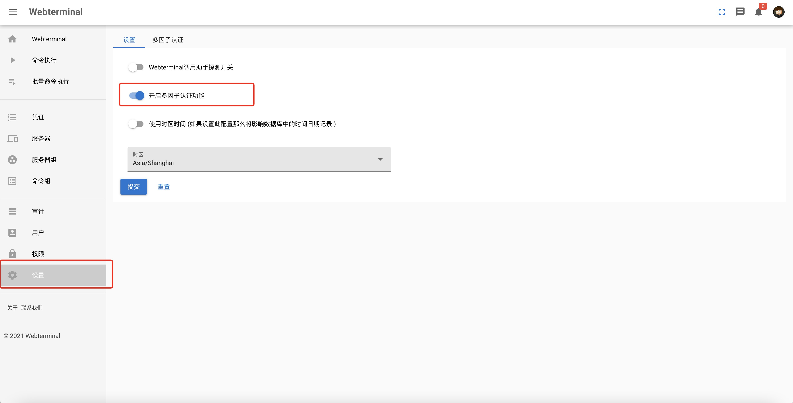

# Webterminal 操作手册

## 添加凭证

## 添加服务器

## 添加服务器组

# 添加命令用于批量操作

# 创建新的登录用户

## 配置用户授权、可登陆的服务器组和可登陆的用户

## webterminal使用

## 批量命令使用

## 审计

# ssh调用助手使用
注册ssh调用助手以便于在用户windows电脑上调用putty软件连接至服务器,使用方法如下
将软件目录helper下webterminal ssh helper.exe安装包文件安装至需要连接至服务器的客户端上。
在服务器列表页面点击putty按钮即可连接至需要连接的服务器

## 更新凭证信息
 	On the left panel you can click the credential list ... Then you can update your info when you click the edit button. If you update all your infomation then click submit button.

## 开启多因子认证登录
  以系统管理员账户登录系统，打开多因子认证登录开关退出登录并重启系统。

## 如果用户未配置多因子认证登录，在首次登录系统时将会引导用户设置多因子登录
 

## 请根据引导说明设置多因子登录
 

## 用多因子登录方式登录系统
 